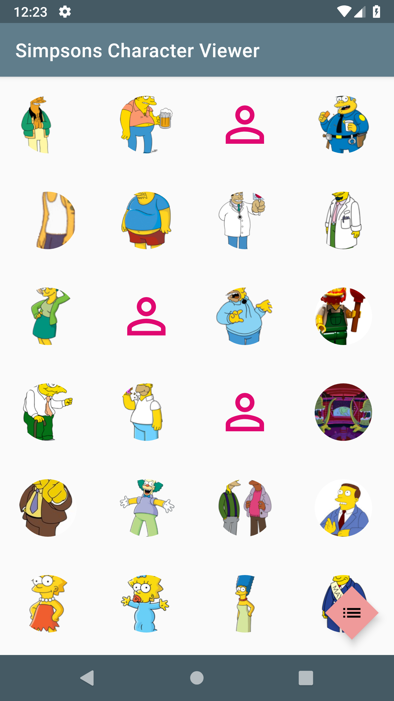
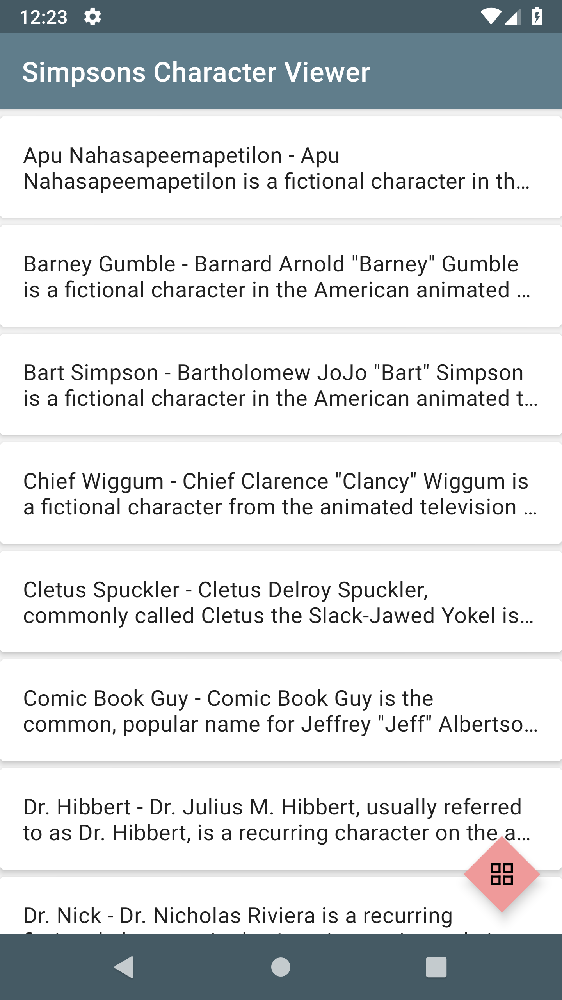
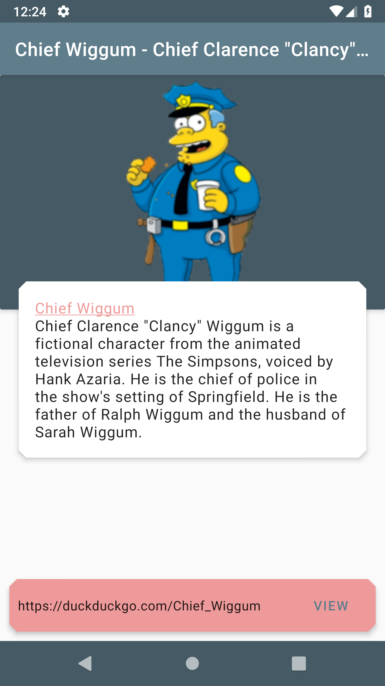
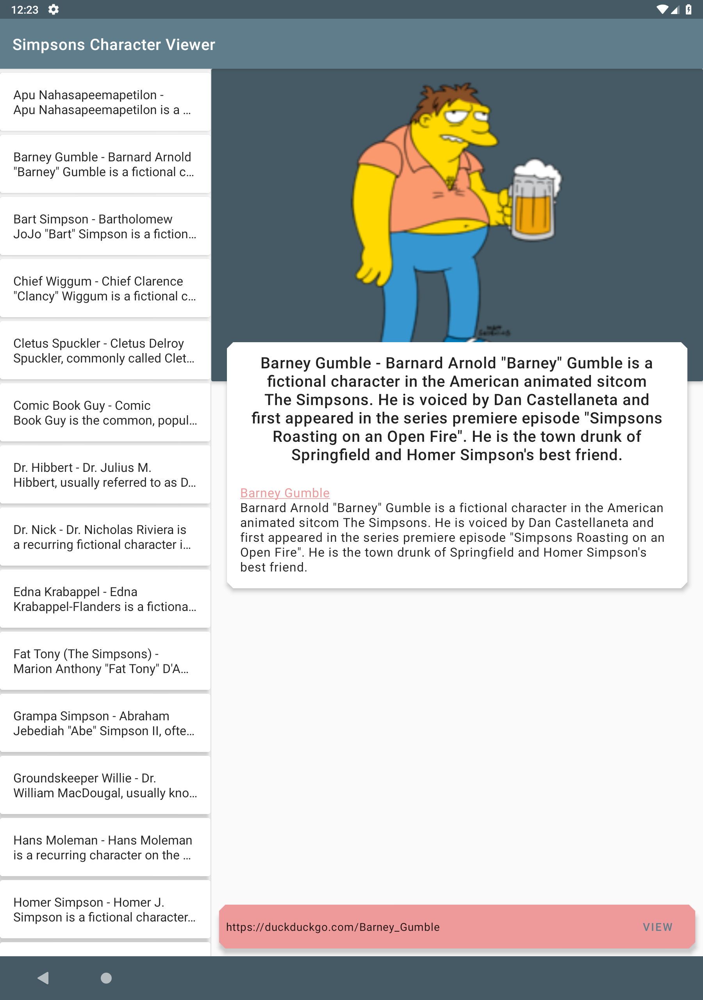
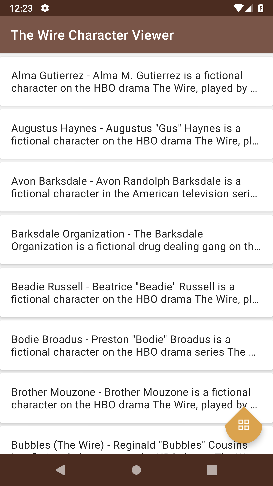
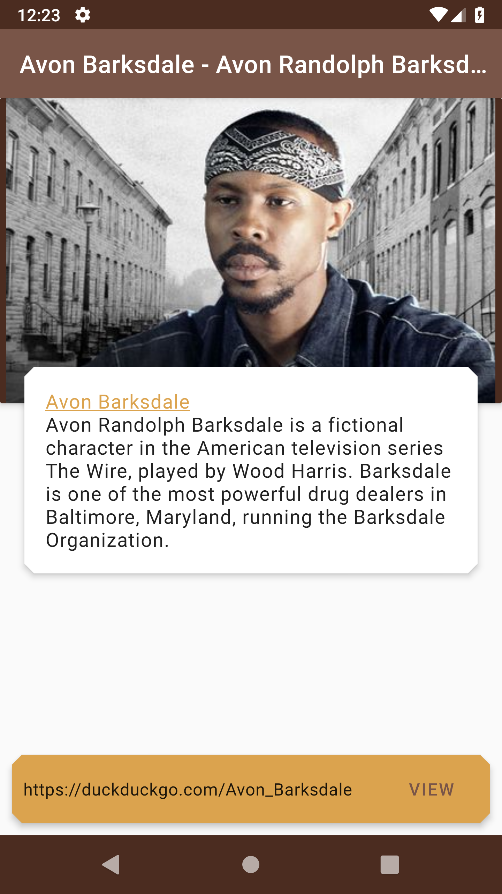
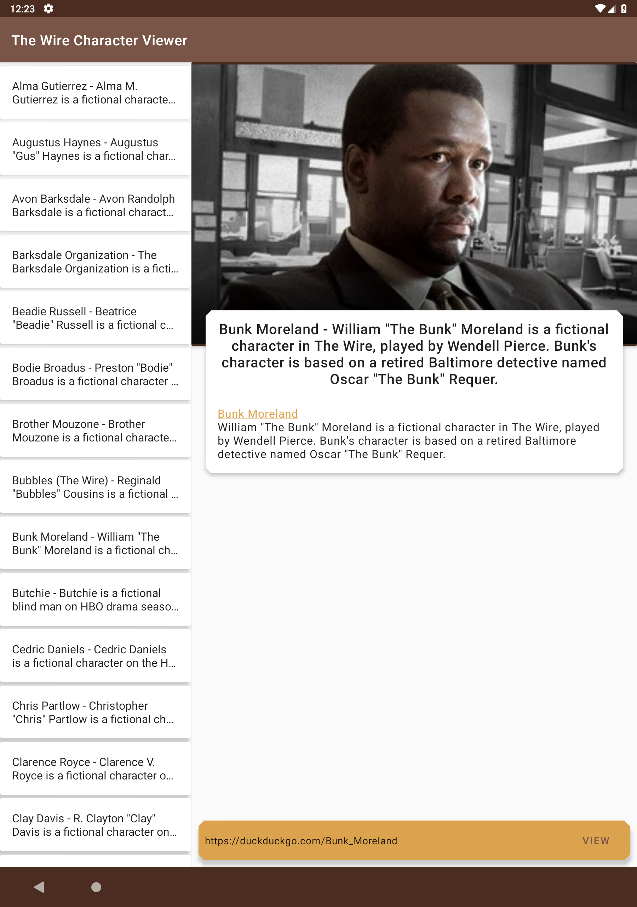
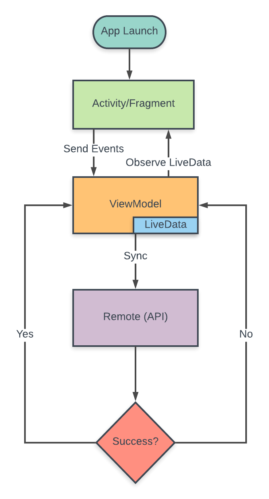

# About this project - CharacterViewer
* A sample Android app to play with http://api.duckduckgo.com/ API.
* It's supporting multiple flavors like simpsonsviewer and wireviewer which you can run through selecting build variants in android studio.
* Simpsonsviewer and Wireviewer both has different contents which load different characters and their details.
* Application made in kotlin with android architecture component, third party libraries and with MVVM design pattern.

# Features

Some of the features of the app include

* Kotlin - Less code to takes less time to write, read, and less susceptible to bugs. It's also provides features like null safety, extension function, inter operable with java, smart cast, etc.

* Effective Networking - Using a combination of Retrofit, RxJava and LiveData, we are able to handle networking in the most effective way.

* MVVM architecture - Using the lifecycle aware viewmodels, the view observes changes in the model.

* Android Architecture Components - Lifecycle awareness has been achieved using a combination of LiveData, ViewModels.

* LeakCanary - A memory detection library to identify any memory leaks in this project.

* Glide - Glide is a fast and efficient open source media management and image loading framework for Android that wraps media decoding, memory and disk caching, and resource pooling into a simple and easy to use interface. it will help to load images with animations in this project.

* Material Components Theme - Used material components theme in this project which gives a powerful UI with different styles, colors and with shape components.

# Demo

# Networking

# BuildInfo
* Android Studio - 3.3.1
* Compile SDK - 28
* Min SDK - 21
* Target SDK - 28

# Libraries Used
* <a href="https://developer.android.com/jetpack/androidx/">AndroidX Support Libraries</a>
* <a href="http://square.github.io/retrofit/">Retrofit</a>
* <a href="http://square.github.io/okhttp/">OkHttp</a>
* <a href="https://developer.android.com/topic/libraries/architecture/viewmodel">ViewModel</a>
* <a href="https://developer.android.com/topic/libraries/architecture/livedata">LiveData</a>
* <a href="https://github.com/ReactiveX/RxJava">RxJava</a>
* <a href="https://github.com/ReactiveX/RxAndroid">RxAndroid</a>
* <a href="https://github.com/square/leakcanary">LeakCanary</a>
* <a href="https://github.com/bumptech/glide">Glide</a>

# Logging
* I have currently used Android Logs for development, but we can modify this with Timber, Crashlytics (Fabric).

# Feedback
* This is a demo development project to showcase my skills and decisions made for development of required tasks. Please forward your inputs at vanditpatel067@gmail.com 

